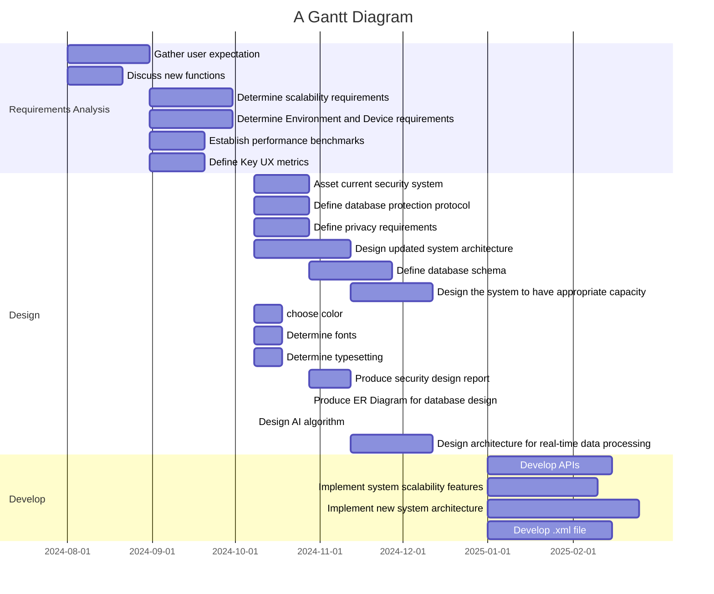

```mermaid
gantt
    title A Gantt Diagram
    dateFormat  YYYY-MM-DD
    section Requirements Analysis
        Gather user expectation: a4, 2024-08-01, 30d
        Discuss new functions: a6, 2024-08-01, 20d
        Determine scalability requirements: a1, after a4, 30d
        Determine Environment and Device requirements: a2, after a4, 30d
        Establish performance benchmarks: a3, after a4, 20d
        Define Key UX metrics: a5, after a4, 20d
        
    section Design
        Asset current security system: b1, 2024-10-08, 20d
        Define database protection protocol: b2, 2024-10-08, 20d
        Define privacy requirements: b3, 2024-10-08, 20d
        Design updated system architecture: b4, 2024-10-08, 35d
        Define database schema: b5, after b2, 30d
        Design the system to have appropriate capacity: b6, after b4, 30d
        choose color: b7, 2024-10-08, 10d
        Determine fonts: b8, 2024-10-08, 10d
        Determine typesetting: b9, 2024-10-08, 10d
        Produce security design report: b10, 2024-10-28 ,15d
        Produce ER Diagram for database design: b11, 2024-10-28, 15
        Design AI algorithm: b12, 2024-10-08, 35
        Design architecture for real-time data processing: b13, 2024-11-12,30d
    section Develop
        Develop APIs: c1, 2025-01-01, 45d
        Implement system scalability features: c2, 2025-01-01, 40d
        Implement new system architecture: c3, 2025-01-01, 55d
        Develop .xml file: c4, 2025-01-01, 45d
        

    


   
```