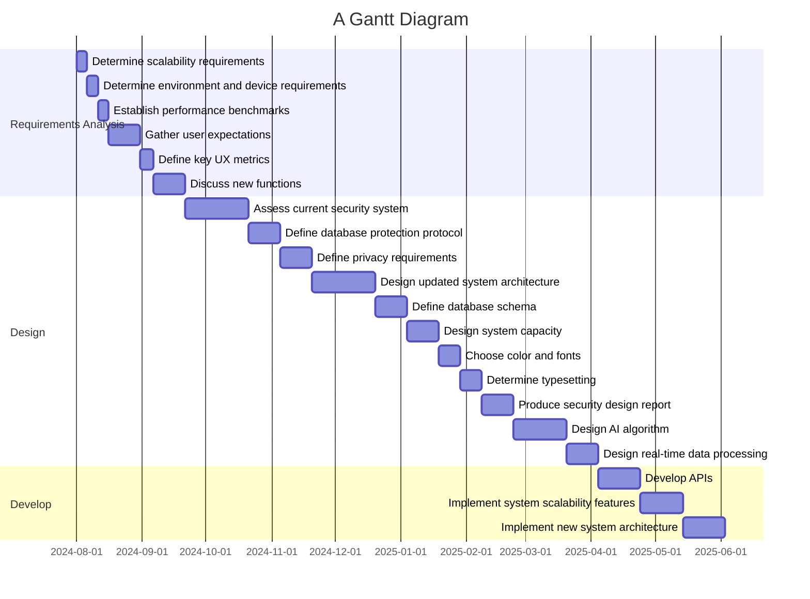

```mermaid
gantt
    title A Gantt Diagram
    dateFormat  YYYY-MM-DD
    section Requirements Analysis
    Determine scalability requirements :a1, 2024-08-01, 5d
    Determine environment and device requirements :a2, after a1, 5d
    Establish performance benchmarks: a3, after a2, 5d
    Gather user expectations: a4, after a3, 15d
    Define key UX metrics : a5, after a4, 6d
    Discuss new functions: a6, after a5, 15d
    section Design
    Assess current security system:b1, after a6, 30d
    Define database protection protocol: b2, after b1, 15d
    Define privacy requirements: b3, after b2, 15d
    Design updated system architecture: b4, after b3, 30d
    Define database schema: b5, after b4, 15d
    Design system capacity: b6, after b5, 15d
    Choose color and fonts: b7, after b6, 10d
    Determine typesetting: b8, after b7, 10d
    Produce security design report: b9, after b8, 15d
    Design AI algorithm: b10, after b9, 25d
    Design real-time data processing: b11, after b10, 15d
    section Develop
    Develop APIs: c1, after b11, 20d
    Implement system scalability features: c2, after c1, 20d
    Implement new system architecture: c3, after c2, 20d
    
    


   
```